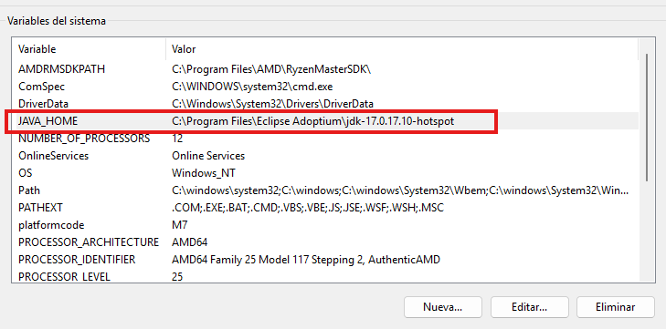
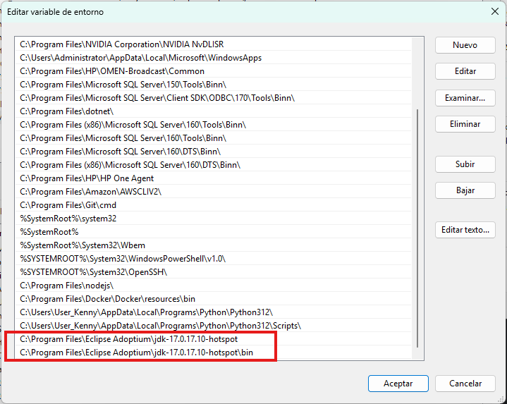
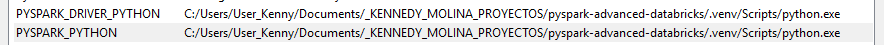

# PySpark Local Setup (Windows) — Guía Resumida

## Requisitos
- Windows 10/11
- Java 11 (OpenJDK)
- Python 3.10+
- Git
- PowerShell

---

## 1. Instalar Java 11
Descargar:
https://adoptium.net/temurin/releases/?version=11

Seleccionar:
- Windows
- x64
- MSI Installer  
Instalar normalmente.

---

## 2. Configurar variables de entorno Java

```powershell
setx JAVA_HOME "C:\Program Files\Eclipse Adoptium\jdk-11.x.x"
setx PATH "%PATH%;%JAVA_HOME%\bin"
```
Cerrar PowerShell y abrir uno nuevo.  
O dirigirse a variables de entorno y agregar las siguientes variable:
  
y en el path  
  
Verificar:
```powershell
java -version
```

---

## 3. Crear entorno virtual

```powershell
python -m venv .venv
.venv\Scripts\activate
```

---

## 4. Instalar dependencias

```powershell
pip install --upgrade pip
pip install pyspark delta-spark pandas pyarrow jupyter
```

---

## 5. Configurar PySpark en Windows

```powershell
setx PYSPARK_PYTHON "C:/Users/User_Kenny/Documents/_KENNEDY_MOLINA_PROYECTOS/pyspark-advanced-databricks/.venv/Scripts/python.exe"
setx PYSPARK_DRIVER_PYTHON "C:/Users/User_Kenny/Documents/_KENNEDY_MOLINA_PROYECTOS/pyspark-advanced-databricks/.venv/Scripts/python.exe"
```  
Agregar variables de entorno para apuntar a Pyspark
  
Cerrar PowerShell y abrir uno nuevo.

---

## 6. Reinstalar PySpark limpio

```powershell
pip uninstall pyspark -y
pip cache purge
pip install pyspark
```

---

## 7. Test funcional rápido

```powershell
python -c "from pyspark.sql import SparkSession; print(SparkSession.builder.getOrCreate())"
```

---

## ✔ Setup listo
Spark local funcionando para:
- joins
- broadcast
- partitioning
- optimización
- tuning
- pruebas de performance
- simulación Databricks local
